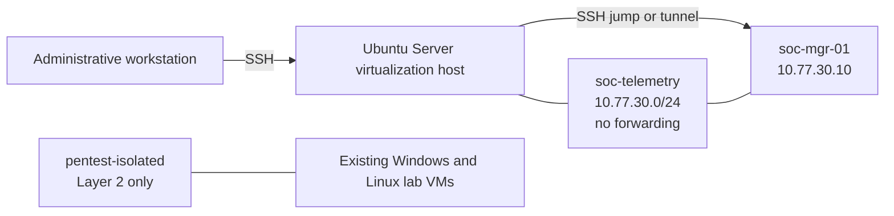
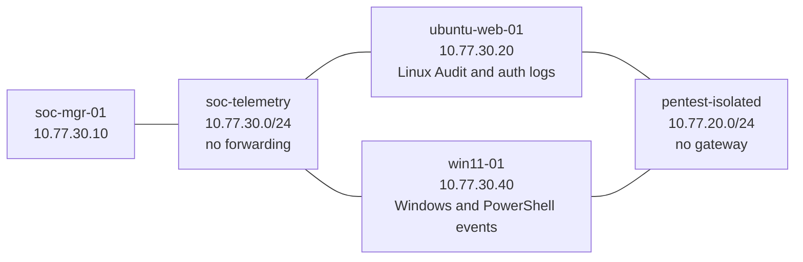
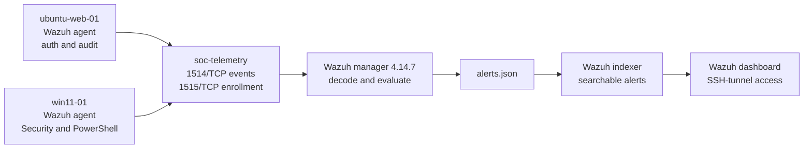
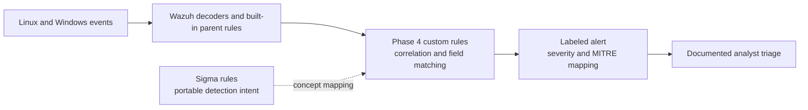
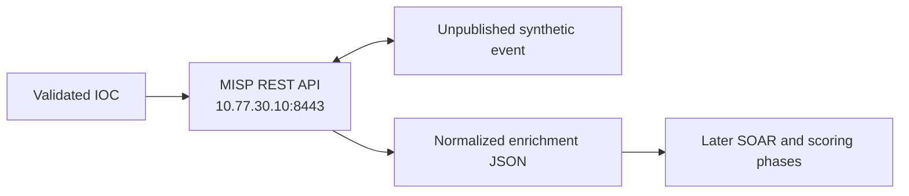
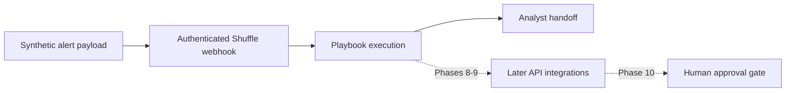
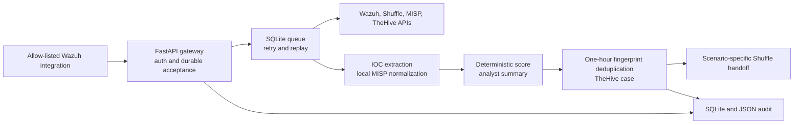
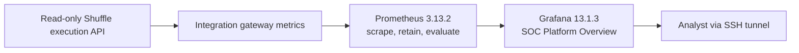

# Architecture

## Final system view

The deployed lab combines the endpoint, detection, intelligence, case, orchestration, integration, approval, forensics, and observability layers documented below. The concise current-state diagrams are maintained in [diagrams/README.md](diagrams/README.md); startup/recovery ordering is maintained separately in [operations/SERVICE_DEPENDENCIES.md](operations/SERVICE_DEPENDENCIES.md).

The current management VM uses 8 vCPUs, 24 GiB RAM, and an 80 GiB sparse virtual disk. It hosts the containerized Wazuh, MISP, TheHive, Shuffle, integration, Prometheus, and Grafana services plus the native Velociraptor server. Linux and Windows endpoints remain separate VMs. This consolidation is appropriate for an attended lab but is the main availability and resource-contention limitation.

The automation path is intentionally split: Wazuh automatically submits allow-listed lab alerts to the durable FastAPI gateway; the gateway performs validation, retry, IOC normalization, enrichment, scoring, incident deduplication, and TheHive handoff; then it invokes a scenario-specific Shuffle workflow for analyst handoff. Approval remains a separately authenticated gateway decision. This distinction prevents the architecture from implying that every integration node runs inside Shuffle.

The corrective path is implemented and locally validated in the repository. The previously deployed Phase 17 baseline did not contain the automatic Wazuh delivery or gateway-triggered Shuffle handoff. Deployment status remains pending until the separate live validation record passes.

## Phase 1 topology

The existing defensive lab remains unchanged in Phase 1. Endpoint telemetry interfaces are added only during Phase 2.

## Network boundaries

`soc-telemetry` is an isolated libvirt network. The virtualization host owns `10.77.30.1` so it can administer the management VM, but the network has no forwarding mode, NAT, DHCP default route, or physical uplink. The management VM uses `10.77.30.10` and has no default gateway after provisioning.

A temporary NAT-backed provisioning interface may be attached while the operating system installs approved packages. It is removed after provisioning, and the provisioning network is then stopped.

## Resource allocation

| Resource | Initial allocation |
|---|---:|
| vCPU | 4 |
| RAM | 12 GiB |
| Virtual disk | 80 GiB sparse QCOW2 |
| Primary address | 10.77.30.10/24 |

The VM does not autostart. Resource use and host-free storage are checked before later services are introduced.

## Phase 2 endpoint layer

The endpoints are dual-homed only between two isolated virtual networks. Neither endpoint has a default route, NAT, physical bridge, or public exposure. The original workload-facing interface remains separate from the telemetry interface. `dc01` and `kali-01` are not part of Phase 2.

| System | Persistent interfaces | Monitoring role |
|---|---|---|
| `soc-mgr-01` | `10.77.30.10/24` | Future Wazuh management and ingestion |
| `ubuntu-web-01` | `10.77.20.20/24`, `10.77.30.20/24` | Linux authentication, privilege, process, and selected file telemetry |
| `win11-01` | `10.77.20.40/24`, `10.77.30.40/24` | Windows authentication, account, process, and PowerShell telemetry |

## Phase 3 Wazuh ingestion layer

The Wazuh containers run on `soc-mgr-01`. Published ports bind only to `10.77.30.10`; administrative access originates from the virtualization host and is tunneled rather than exposed to the physical LAN. Enrollment is password-authenticated, and active response is disabled. Custom detection content is intentionally reserved for Phase 4.

## Phase 4 detection layer

Sigma content is stored alongside the executable Wazuh rules but is not treated as a drop-in Wazuh ruleset. Translation requires a target backend and field-mapping pipeline. Live Wazuh rules inherit decoded source events, and all response actions remain disabled.

## Phase 5 threat-intelligence layer

MISP 2.5.44 runs on `soc-mgr-01` beside Wazuh with one worker per queue. MariaDB, Redis, MISP core, MISP modules, and local mail communicate on a private container network. Only the core HTTP/HTTPS ports are published, and they bind to the isolated telemetry address. The platform has no default route in steady state.

The Phase 5 client supports IP, domain, URL, and hash lookup. It rejects malformed input, queries local MISP, and produces a stable result contract. An IOC match supplies context but does not trigger automatic containment.

## Phase 6 incident-management layer

TheHive adds the investigation system of record on `soc-mgr-01`. Cassandra stores case data, Elasticsearch supports indexing, and nginx exposes the application only on `10.77.30.10:9443`. The direct TheHive port is loopback-only. Wazuh and MISP remain separate systems with distinct data and credentials; orchestration between them is introduced later.

The management VM is sized to 24 GiB RAM and 8 vCPUs for the combined Wazuh, MISP, and TheHive lab profile. This remains a single-node portfolio design, not a claim of production high availability.

## Phase 7 orchestration layer

Shuffle 2.2.1 runs on `soc-mgr-01` with its UI on the telemetry address, backend API on loopback, and OpenSearch on the private Compose network. Orborus uses standalone Docker workers because this host's live-restore setting is incompatible with swarm initialization.

At the Phase 7 checkpoint, the workflow graph proved authenticated intake, execution tracking, and safe analyst handoff without connecting Wazuh, MISP, or TheHive. The corrective candidate now seeds five multi-step handoff graphs and invokes the selected Shuffle webhook only after durable gateway processing; all workflows still stop before any response action.

The backend and Orborus mount the Docker socket to launch isolated app and worker containers. This is a high-trust single-node lab boundary and would require stronger isolation and redundancy in production.

## Phase 8 integration gateway

The gateway uses host networking so it can reach the loopback-only Shuffle and TheHive APIs, but Uvicorn binds only to `10.77.30.10:8010`. It is not reachable from the physical LAN. Platform credentials remain in a protected runtime environment file.

The webhook path persists the canonical payload before acknowledging it. A background worker composes the vendor clients through small enrichment, scoring, reporting, incident, and Shuffle modules. Delivery replay keys, Shuffle handoff reservations, and cross-alert incident fingerprints are separate controls. The pipeline ends at analyst handoff and cannot execute containment.

## Phase 10 approval control plane

The integration gateway now separates automation proposals from analyst decisions. The automation credential can create a pending record but cannot finalize it. A second generated credential controls approve, reject, and escalate branches. Durable SQLite state prevents decision loss across restarts, structured JSON events provide an audit trail, and TheHive receives best-effort case comments.

The response executor is intentionally not a general endpoint connector. It can change only the application-level `soc-response-test` identity from enabled to disabled. This preserves the architectural pattern of governed automation while keeping the lab response harmless and contained.

## Phase 11 endpoint investigation

Velociraptor runs as a resource-bounded native service on `soc-mgr-01`. Its client frontend and GUI bind only to the telemetry address; the API is loopback-only. Linux and Windows clients initiate encrypted connections over `soc-telemetry`, so no physical-LAN or Internet route is required.

Collections are separate from the alert-processing path. An analyst uses incident context to choose bounded artifacts, reviews results, and returns findings to the case. Velociraptor does not invoke the Phase 10 executor or perform remediation.

## Phase 12 failure isolation

Failure drills enter at explicit system boundaries: webhook schema, delivery idempotency, API transport, upstream authentication, incident handoff, IOC validation, and endpoint heartbeat. Live calls are limited to non-mutating gateway behavior. Potentially disruptive conditions use in-process substitutes, so the test signal is deterministic and production-like without stopping the actual lab services.

The integration client emits sanitized structured retry and terminal events. Readiness identifies the affected dependency, while persistent webhook and pipeline audit records preserve transaction disposition. Recovery is complete only when the named dependency and the aggregate readiness endpoint are healthy.

## Phase 13 observability layer

Prometheus listens only on management-VM loopback and scrapes the gateway over the isolated telemetry address. Grafana is reachable only on the telemetry network and uses a generated local credential. Prometheus retains seven days and evaluates local health rules; no external notification or telemetry destination is configured.

Application labels are intentionally bounded. Alert IDs, users, endpoints, indicators, and incident identifiers do not become metric labels. The monitoring plane is single-node and shares the management VM with the services it observes, so it demonstrates operational visibility rather than independent production monitoring.
