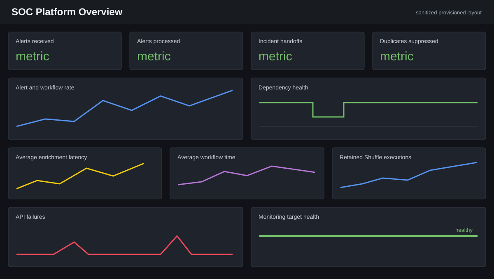

# SOC Automation Engineering Lab

An isolated, self-hosted security operations lab for validating alert ingestion, detection engineering, orchestration, threat-intelligence enrichment, incident handling, endpoint investigation, approval-gated response, and operational reliability.

> **Corrective integration status:** The durable Wazuh-to-gateway adapter, asynchronous worker, gateway-to-Shuffle handoff, analyst tooling, bounded triage records, and queue observability are deployed and live-validated on the isolated lab. The endpoint-originated lifecycle, approval boundary, retry recovery, idempotency, observability, and reboot recovery passed. See the [sanitized live evidence](evidence/corrective-integration-live-validation.json).

> **Current runtime state:** The `soc-mgr-01` management VM was gracefully shut down after validation on August 14, 2026, and `virsh domstate` confirmed `shut off`. The deployed lab is intentionally offline until its next attended session.

## Problem and outcome

Security operations platforms must move an alert across several unreliable systems without losing evidence, creating duplicate incidents, leaking credentials, or taking an unsafe action. This project implements that lifecycle on owned, isolated infrastructure using synthetic data and a $0 software stack.

The result is a working reference environment—not a collection of disconnected scripts. Linux and Windows events reach Wazuh; authenticated automation validates and deduplicates alerts; local MISP data enriches indicators; deterministic scoring prepares an analyst summary; TheHive records the incident; Shuffle demonstrates webhook orchestration; Velociraptor supports bounded endpoint triage; a separate approval credential gates the only harmless response; and Prometheus/Grafana monitor the platform itself.

## Current architecture

~~~mermaid
flowchart LR
    Linux[Linux endpoint] --> Wazuh[Wazuh SIEM]
    Windows[Windows endpoint] --> Wazuh
    Wazuh --> Gateway[Durable FastAPI intake]
    Gateway --> Queue[SQLite delivery queue]
    Queue --> MISP[MISP enrichment]
    MISP --> Score[Scoring and summary]
    Score --> Hive[TheHive case]
    Hive --> Shuffle[Shuffle SOAR handoff]
    Shuffle --> Handoff[Analyst handoff]
    Hive --> Analyst[Analyst review]
    Analyst --> Gate[Separate approval gate]
    Gate --> Response[Allow-listed lab response]
    Analyst --> Velo[Velociraptor triage]
    Gateway --> Audit[Structured audit trail]
    Gateway --> Metrics[Prometheus and Grafana]
~~~

All persistent service listeners are restricted to the isolated soc-telemetry network or management-VM loopback. The management VM and monitored endpoints have no steady-state default route.

See [ARCHITECTURE.md](ARCHITECTURE.md) for deployment boundaries and [diagrams/README.md](diagrams/README.md) for architecture, event-sequence, and approval-flow diagrams.

## Implemented stack

| Capability | Implementation | Demonstrated engineering |
|---|---|---|
| Security monitoring | Wazuh 4.14.7 | Agent enrollment, Linux/Windows ingestion, custom rules, indexed alerts |
| Detection as code | Wazuh rules and Sigma | Test events, false positives, tuning, MITRE mapping, lifecycle documentation |
| Orchestration | Shuffle 2.2.1 and FastAPI | Durable authenticated delivery, API clients, retries, case correlation, structured handoff |
| Threat intelligence | MISP 2.5.44 | Local synthetic IOC data, normalization, confidence, reputation, provenance |
| Incident management | TheHive 5.7.3 | Cases, observables, tasks, notes, lifecycle state, API creation and reuse |
| Endpoint investigation | Velociraptor 0.77.1 | Bounded live triage across Linux and Windows without file acquisition |
| Platform visibility | Prometheus 3.13.2 and Grafana 13.1.3 | Metrics, seven health rules, eleven-panel dashboard, readiness and queue checks |
| Engineering quality | Python, Bash, PowerShell, pytest, GitHub Actions | Modular clients, mocked tests, detection validation, linting, documentation checks |

## Alert lifecycle

1. A safe synthetic endpoint action produces a Linux or Windows security event.
2. The Wazuh agent forwards it and the manager evaluates built-in and custom detection logic.
3. The authenticated gateway validates and durably persists the alert before returning HTTP 202.
4. Indicators are extracted, normalized, and queried only against local MISP.
5. Explainable scoring combines detection severity, intelligence confidence, and context.
6. A separate incident fingerprint creates or reuses the appropriate TheHive case.
7. The gateway invokes the scenario-specific Shuffle workflow and records its execution identifier.
8. The analyst reviews the case and may request bounded Velociraptor evidence.
9. Any response remains pending until an independently authenticated approve, reject, or escalate decision.
10. Only an approved, allow-listed application-level test action can execute; every branch is audited.
11. Validation confirms service recovery, case state, response result, and closure evidence.

The detailed procedure is in [SOC_OPERATIONS.md](SOC_OPERATIONS.md) and [INCIDENT_RESPONSE_PLAN.md](INCIDENT_RESPONSE_PLAN.md).

## Portfolio evidence

| Area | Saved evidence |
|---|---|
| Authenticated webhook, malformed input, and duplicate handling | [Phase 8 validation](evidence/phase8-live-validation.json) |
| IOC enrichment, scoring, case creation/reuse, and reboot recovery | [Phase 9 validation](evidence/phase9-live-validation.json) |
| Approve/reject/escalate branches and allow-list controls | [Phase 10 validation](evidence/phase10-live-validation.json) |
| Eight controlled integration failures | [Phase 12 validation](evidence/phase12-live-validation.json) |
| Prometheus rules and Grafana provisioning | [Phase 13 validation](evidence/phase13-live-validation.json) |
| CI, linting, tests, and repository validation | [Phase 15 validation](evidence/phase15-ci-validation.json) |
| Live service, capacity, and isolation health | [Phase 16 validation](evidence/phase16-operations-validation.json) |
| Final portfolio, documentation, tests, and live health | [Phase 17 validation](evidence/phase17-portfolio-validation.json) |
| Corrective durable lifecycle implementation | [Local validation](evidence/corrective-integration-local-validation.json), [live validation](evidence/corrective-integration-live-validation.json), and [implementation record](docs/CORRECTIVE_IMPLEMENTATION.md) |

All evidence is synthetic and sanitized. Raw logs, credentials, internal PKI, database contents, and forensic archives remain outside Git. See the [evidence index](docs/PORTFOLIO_EVIDENCE.md) for claim-to-artifact traceability.

The Phase 17 live baseline recorded 96 automated tests, three Sigma/Wazuh detections, four original SOAR playbooks, eight failure drills, five Prometheus rules, eleven Grafana panels, and seventeen management-VM health checks. The corrective repository candidate adds a fifth fallback playbook, durable processing, two queue-health rules, Wazuh delivery, Shuffle handoff, and additional tests; it does not rewrite that historical evidence.

## Dashboard preview

This portfolio-safe preview is derived from the committed Grafana provisioning definition. It shows the implemented panel layout without exposing a live administrative session, credentials, alert identifiers, or endpoint data. The executable dashboard source is [soc-platform-overview.json](observability/grafana/dashboards/soc-platform-overview.json).

## Playbooks and detections

| Use case | Detection/trigger | Automation outcome | Response boundary |
|---|---|---|---|
| Suspicious login | Repeated invalid-user SSH attempts | IP normalization, enrichment, scoring, case handoff | Notify/recommend only |
| Suspicious file | Validated SHA-256 alert input | Hash enrichment and endpoint-context handoff | Recommend only |
| Suspicious domain | Validated synthetic domain | Enrichment, prior context, score, case create/reuse | No blocking |
| Account activity | Windows user creation/authentication context | Risk summary and approval proposal | Separate approval required |
| Encoded PowerShell | Harmless encoded Write-Output test | Wazuh alert and documented investigation | Detection only |
| General security alert | Validated synthetic fallback | Case-correlated analyst handoff | Notify only |

See [PLAYBOOKS.md](PLAYBOOKS.md), [DETECTION_ENGINEERING.md](DETECTION_ENGINEERING.md), and [THREAT_INTELLIGENCE.md](THREAT_INTELLIGENCE.md).

## Security and operational controls

- $0 local infrastructure and open-source/community software; no paid cloud dependency.
- Owned systems, reserved test indicators, synthetic accounts, and harmless commands only.
- Generated runtime secrets stay outside Git with restricted permissions.
- Telemetry-only bindings, loopback administrative APIs, and no steady-state default route.
- Bounded retries, explicit timeouts, delivery idempotency, incident deduplication, and sanitized errors.
- Human approval separate from automation and execution; reject/escalate never mutate state.
- Read-only health snapshot, dependency-aware recovery, change control, backup guidance, and handoff procedure.
- Mock-only CI with read-only repository permission and no path to the private lab.

See [SECURITY.md](SECURITY.md), [RUNBOOK.md](RUNBOOK.md), and [TROUBLESHOOTING.md](TROUBLESHOOTING.md).

## Commercial-platform transfer

The lab does not claim product equivalence. Shuffle demonstrates workflow concepts relevant to Tines; MISP demonstrates threat-intelligence lifecycle concepts relevant to ThreatQ; and the combined investigation, context, evidence, human oversight, and audit workflow demonstrates selected operating concepts relevant to Andesite. See the [commercial platform mapping](docs/COMMERCIAL_PLATFORM_MAPPING.md) for exact transferable concepts and explicit gaps.

## Known limitations

This is an attended, single-node portfolio lab. It does not implement production high availability, an external message broker, independent monitoring, off-host backups, enterprise identity, multi-analyst RBAC, real paging, production data retention, automated feed governance, or broad endpoint containment. Shuffle's live graph is intentionally small; the Python gateway performs the richer enrichment and case pipeline. See [KNOWN_LIMITATIONS.md](docs/KNOWN_LIMITATIONS.md).

## Repository map

~~~text
docker/          pinned platform deployment and validation
detections/      Sigma, Wazuh rules, test events, rule documentation
playbooks/       Shuffle workflow fixtures, seeding, invocation, results
src/             modular Python gateway, integrations, scoring, audit, approval
endpoints/       Linux Bash and Windows PowerShell monitoring configuration
threat-intel/    MISP seeding, IOC validation, normalized examples
incidents/       TheHive case fixture, seeding, sanitized result
forensics/       Velociraptor artifacts, collection plan, sanitized coverage
observability/   Prometheus rules and provisioned Grafana dashboard
operations/      health, escalation, recovery, backup, change, maintenance
tests/           mocked API, pipeline, safety, configuration, and asset tests
evidence/        sanitized live and CI validation summaries
docs/            phase records, mappings, limitations, and evidence index
diagrams/        portfolio-safe architecture and dashboard visuals
~~~

Start with [SOC_OPERATIONS.md](SOC_OPERATIONS.md) for the analyst flow, [RUNBOOK.md](RUNBOOK.md) for platform operation, [docs/PORTFOLIO_EVIDENCE.md](docs/PORTFOLIO_EVIDENCE.md) for claim traceability, and [docs/JOB_REQUIREMENTS_MAPPING.md](docs/JOB_REQUIREMENTS_MAPPING.md) for demonstrated skills and remaining gaps.

## Repository map

~~~text
docker/          pinned platform deployment and validation
detections/      Sigma, Wazuh rules, test events, rule documentation
playbooks/       Shuffle workflow fixtures, seeding, invocation, results
src/             modular Python gateway, integrations, scoring, audit, approval
endpoints/       Linux Bash and Windows PowerShell monitoring configuration
threat-intel/    MISP seeding, IOC validation, normalized examples
incidents/       TheHive case fixture, seeding, sanitized result
forensics/       Velociraptor artifacts, collection plan, sanitized coverage
observability/   Prometheus rules and provisioned Grafana dashboard
operations/      health, escalation, recovery, backup, change, maintenance
tests/           mocked API, pipeline, safety, configuration, and asset tests
evidence/        sanitized live and CI validation summaries
docs/            phase records, mappings, limitations, and evidence index
diagrams/        portfolio-safe architecture and dashboard visuals
~~~

Start with [SOC_OPERATIONS.md](SOC_OPERATIONS.md) for the analyst flow, [RUNBOOK.md](RUNBOOK.md) for platform operation, [docs/PORTFOLIO_EVIDENCE.md](docs/PORTFOLIO_EVIDENCE.md) for claim traceability, and [docs/JOB_REQUIREMENTS_MAPPING.md](docs/JOB_REQUIREMENTS_MAPPING.md) for demonstrated skills and remaining gaps.

## Current status

| Phase | Scope | Status |
|---|---|---|
| 0 | Architecture and requirements | Complete |
| 1 | Isolated lab and container infrastructure | Complete |
| 2 | Windows and Linux endpoint monitoring | Complete |
| 3 | Wazuh alert ingestion | Complete |
| 4 | Detection engineering and Sigma | Complete |
| 5 | Threat intelligence and MISP | Complete |
| 6 | TheHive incident management | Complete |
| 7 | Shuffle SOAR automation | Complete |
| 8 | Python API and webhook integrations | Complete |
| 9 | Automated enrichment and scoring | Complete |
| 10 | Human approval and response workflows | Complete |
| 11 | Basic Velociraptor forensic triage | Complete |
| 12 | Failure simulation and troubleshooting | Complete |
| 13 | Monitoring the SOC platform | Complete |
| 14 | Automated tests | Complete |
| 15 | GitHub Actions CI/CD | Complete |
| 16 | Operational runbooks | Complete |
| 17 | Documentation and portfolio cleanup | Complete |
| Corrective lifecycle | Wazuh delivery, durable processing, Shuffle handoff, analyst operations | Deployed and live-validated; lab intentionally powered off after validation |

Only capabilities supported by saved validation evidence are described as implemented.

## Phase 1 result

Phase 1 established:

- a dedicated `soc-telemetry` virtual network with no Internet or physical-LAN forwarding;
- a dedicated Ubuntu Server management VM;
- Docker Engine and Compose support inside that VM;
- host-to-guest SSH and guest-agent administration;
- validated resource, isolation, reboot, and rollback boundaries.

Central security platforms and collection agents are introduced in later phases.

## Phase 2 result

Phase 2 added isolated telemetry interfaces to one Linux and one Windows endpoint. Linux Audit now records focused identity, privilege, process, and test-file activity. Windows audit policy now records authentication, account-management, process-creation, and PowerShell activity. Benign validation produced Linux audit evidence and Windows event IDs 4688 and 4104 after reboot, with no endpoint default routes.

Central forwarding was introduced and validated in Phase 3. See the [Phase 2 completion report](docs/PHASE_2_COMPLETION.md) and [Windows/Linux log-source comparison](docs/WINDOWS_LINUX_LOG_SOURCES.md).

## Phase 3 result

Phase 3 deployed a pinned Wazuh 4.14.7 single-node manager, indexer, and dashboard on `soc-mgr-01`, then enrolled the Linux and Windows endpoints with password authentication. Built-in Wazuh processing recorded synthetic Linux failed-login and Windows temporary-account alerts. All services and agents recovered after reboot, the indexer was green, and steady-state systems retained no default route.

Active response is disabled at the manager and on both endpoints. See the [Phase 3 completion report](docs/PHASE_3_COMPLETION.md), [implementation guide](docs/PHASE_3_IMPLEMENTATION.md), and [validation record](docs/PHASE_3_VALIDATION.md).

## Phase 4 result

Phase 4 introduced three detection-as-code use cases: repeated invalid-user SSH attempts, encoded PowerShell, and Windows user creation. Each has a live Wazuh rule, a Sigma representation, a safe test event, MITRE mapping, severity, false-positive analysis, validation steps, tuning guidance, and an analyst response recommendation. All three produced live alerts and remain explicitly test-status content pending broader false-positive measurement.

See [DETECTION_ENGINEERING.md](DETECTION_ENGINEERING.md), the [Phase 4 completion report](docs/PHASE_4_COMPLETION.md), and the [detection repository](detections/README.md).

## Phase 5 result

Phase 5 deployed MISP 2.5.44 locally with generated credentials, reduced workers, telemetry-only bindings, and no steady-state default route. An idempotent seed created four reserved or benign synthetic indicators. A Python client validates IP, domain, URL, and hash inputs and emits consistent enrichment JSON for both matches and unknown indicators.

See [THREAT_INTELLIGENCE.md](THREAT_INTELLIGENCE.md), the [Phase 5 completion report](docs/PHASE_5_COMPLETION.md), and the [local intelligence workflow](threat-intel/README.md).

## Phase 6 result

Phase 6 deployed TheHive 5.7.3 with dedicated Cassandra and Elasticsearch services, generated credentials, telemetry-only access, and no steady-state default route. One API-created synthetic case demonstrates observables, investigation tasks, analyst notes, pending human approval, and idempotent seeding. Wazuh-to-TheHive automation is intentionally deferred to the orchestration phases.

See the [incident response plan](INCIDENT_RESPONSE_PLAN.md), [incident workflow](incidents/README.md), and [Phase 6 completion report](docs/PHASE_6_COMPLETION.md).

## Phase 7 result

Phase 7 deployed Shuffle 2.2.1 in standalone worker mode and seeded four authenticated SOAR workflows for suspicious login, suspicious file, suspicious domain, and account activity. Every synthetic webhook test rejected missing authentication with 401, accepted the correct header with 200, and reached `FINISHED`.

At the Phase 7 checkpoint, the workflows captured validated alert context while later integration remained deferred. The corrective candidate now updates those graphs and connects them after durable gateway processing; the historical Phase 7 evidence remains unchanged.

See [PLAYBOOKS.md](PLAYBOOKS.md), the [Phase 7 completion report](docs/PHASE_7_COMPLETION.md), and the [validation record](docs/PHASE_7_VALIDATION.md).

## Phase 8 result

Phase 8 deployed a hardened FastAPI gateway on `soc-mgr-01`. It authenticates and validates synthetic Wazuh-style alerts, persists idempotency decisions, writes structured audit events, and performs authenticated health checks against Wazuh, Shuffle, MISP, and TheHive.

The integration clients implement explicit timeouts, bounded retries, rate-limit handling, and sanitized error categories. Live validation covered HTTP 401 authentication rejection, HTTP 422 malformed input, accepted and duplicate HTTP 202 receipts, and recovery without a default route.

See [API_INTEGRATIONS.md](API_INTEGRATIONS.md), the [Phase 8 completion report](docs/PHASE_8_COMPLETION.md), and the [validation record](docs/PHASE_8_VALIDATION.md).

## Phase 9 result

Phase 9 connected the gateway to local MISP and TheHive. It validates and normalizes IP, domain, URL, and file-hash indicators; calculates an explainable deterministic score; creates analyst summaries; and creates or reuses TheHive incidents.

Delivery idempotency suppresses transport replays, while a separate one-hour fingerprint based on rule, endpoint, and normalized indicators prevents cross-alert case flooding without suppressing later investigations indefinitely. Live validation created one case, reused it for a distinct matching alert, suppressed a replayed delivery, and passed again after reboot. All 26 automated tests pass.

No response action is present. See [AUTOMATED_ENRICHMENT.md](AUTOMATED_ENRICHMENT.md), the [Phase 9 completion report](docs/PHASE_9_COMPLETION.md), and the [validation record](docs/PHASE_9_VALIDATION.md).

## Phase 10 result

Phase 10 inserted a durable human-approval gate between automation and response. A separate approval credential controls approve, reject, and escalate decisions; exact schema allow lists permit only disabling the application-level synthetic identity `soc-response-test`. Rejection and escalation never execute, repeated decisions are idempotent, and conflicting decisions are rejected.

Live validation exercised every decision branch, authorization failure, off-allow-list input, conflict handling, audit persistence, and reboot recovery. The executor has no operating-system, Active Directory, or endpoint administration capability. All 31 automated tests pass.

See [HUMAN_APPROVAL.md](HUMAN_APPROVAL.md), the [Phase 10 completion report](docs/PHASE_10_COMPLETION.md), and the [validation record](docs/PHASE_10_VALIDATION.md).

## Phase 11 result

Phase 11 deployed Velociraptor 0.77.1 on the isolated management VM and enrolled the Linux and Windows endpoints. A bounded triage workflow collected running processes, network connections, users, login context, startup items/services, selected Windows events, and metadata plus hashes for two synthetic files.

Twelve non-empty collection containers passed integrity validation and survived reboot. Both endpoint binaries match official published hashes, all listeners remain isolated, and the existing SOC stack recovered healthy. Raw endpoint results remain private; only sanitized coverage evidence is committed. All 34 automated tests pass.

See the [forensic triage guide](forensics/README.md), [Phase 11 completion report](docs/PHASE_11_COMPLETION.md), and [sanitized result](forensics/example-results/phase11-summary.json).

## Phase 12 result

Phase 12 added eight controlled failure drills covering unavailable threat intelligence, malformed webhook input, API timeout, duplicate delivery, unavailable incident management, endpoint disconnection, malformed IOCs, and service authentication failure.

The real gateway handled schema and duplicate tests. All potentially disruptive conditions used local substitutes or synthetic heartbeat data, so no platform or endpoint service was stopped. Retry and terminal events are structured and sanitized, every drill proved that no response action executed, normal readiness remained healthy, and all 40 automated tests pass.

See [TROUBLESHOOTING.md](TROUBLESHOOTING.md), the [failure scenario register](operations/FAILURE_SCENARIOS.md), and the [Phase 12 completion report](docs/PHASE_12_COMPLETION.md).

## Phase 13 result

Phase 13 added bounded gateway metrics, a read-only Shuffle execution collector, Prometheus 3.13.2 with seven-day local retention and five health rules, and Grafana 13.1.3 with an eleven-panel SOC Platform Overview dashboard.

Live validation confirmed healthy services, a healthy gateway scrape target, successful Shuffle collection, authenticated dashboard access, restricted listeners, protected credentials, and no management-VM default route. All 49 automated tests pass. No external telemetry or automated response was introduced.

See [OBSERVABILITY.md](OBSERVABILITY.md), the [observability deployment](observability/README.md), and the [Phase 13 completion report](docs/PHASE_13_COMPLETION.md).

## Phase 14 result

Phase 14 expanded the fully mocked test suite from 49 to 83 tests. Coverage now explicitly exercises configuration bounds and secret redaction, webhook contracts, all supported IOC types, malformed intelligence metadata, scoring boundaries, delivery and incident deduplication, vendor API request contracts, retry behavior, pipeline recovery, concurrent audit writes, dependency health, and fail-closed approval enforcement.

The suite has no live API dependency and completed in under one second of test execution. Strict pytest configuration rejects unknown settings and markers. See [TESTING.md](TESTING.md), the [test matrix](tests/README.md), and the [Phase 14 completion report](docs/PHASE_14_COMPLETION.md).

## Phase 15 result

Phase 15 added a security-bounded GitHub Actions workflow that runs Ruff, repository asset and documentation-link validation, native and pySigma detection validation, checksum-verified actionlint, and all 86 mocked tests.

The workflow uses one time-limited GitHub-hosted runner, read-only repository permission, immutable action commit SHAs, non-persistent checkout credentials, and no secrets, deployment job, self-hosted runner, artifact upload, or lab connectivity. See [CI_CD.md](CI_CD.md), the [workflow](.github/workflows/ci.yml), and the [Phase 15 completion report](docs/PHASE_15_COMPLETION.md).

## Phase 16 result

Phase 16 added the root [operations runbook](RUNBOOK.md), focused procedures for escalation, service dependencies, health thresholds, failed-playbook recovery, backup/restore, change control, maintenance, and shift handoff, plus a read-only JSON health snapshot for the management VM.

The operating model preserves idempotency and approval state during recovery, distinguishes same-host VM recovery copies from application-consistent backup, and clearly separates attended-lab objectives from real 24x7 availability claims. See the [operations index](operations/README.md) and [Phase 16 completion report](docs/PHASE_16_COMPLETION.md).

## Phase 17 result

Phase 17 reorganized the repository presentation around the implemented system rather than its build sequence. The README now presents architecture, lifecycle, stack, evidence, visual dashboard layout, controls, commercial transfer, and limitations; dedicated documents cover SOC operations, claim traceability, job requirements, and Tines/ThreatQ/Andesite concept mapping.

Final portfolio validation confirms that the documentation links, configuration assets, diagrams, detections, tests, and live operating claims remain consistent. See the [Phase 17 completion report](docs/PHASE_17_COMPLETION.md).

## Phase 17 result

Phase 17 reorganized the repository presentation around the implemented system rather than its build sequence. The README now presents architecture, lifecycle, stack, evidence, visual dashboard layout, controls, commercial transfer, and limitations; dedicated documents cover SOC operations, claim traceability, job requirements, and Tines/ThreatQ/Andesite concept mapping.

Final portfolio validation confirms that the documentation links, configuration assets, diagrams, detections, tests, and live operating claims remain consistent. See the [Phase 17 completion report](docs/PHASE_17_COMPLETION.md).

## Safety boundary

The lab is limited to owned systems and deliberately created test data. It does not scan public hosts, execute malware, collect real credentials, or perform automatic destructive response actions.

See [ARCHITECTURE.md](ARCHITECTURE.md), [SECURITY.md](SECURITY.md), and the [Phase 1 completion report](docs/PHASE_1_COMPLETION.md).
