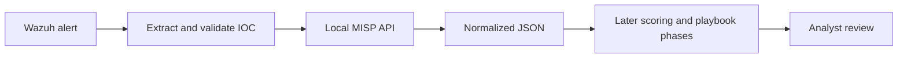

# Threat Intelligence

## Implemented capability

Phase 5 runs MISP 2.5.44 as a local threat-intelligence platform on `soc-mgr-01`. The deployment uses the pinned official `misp-docker` source at commit `223b675c4480730832f928e113b6f2e5260b450d`, binds its web/API ports only to `10.77.30.10`, and operates without a default route after provisioning.

The local event `SOC Lab Synthetic Threat Intelligence` contains four controlled indicators: a TEST-NET-2 address, a reserved `.test` domain, a reserved `.test` URL, and the SHA-256 of a benign marker string. None is evidence of real malicious activity. Their suspicious reputation is an intentional lab label used to validate downstream triage.

## Why a SOC uses threat intelligence

Threat intelligence adds context to an observable. An alert may contain an IP, domain, URL, or hash; an enrichment step asks whether trusted sources have seen it, what they assert, how reliable that assertion is, and whether it changes analyst priority.

- An IOC is an observable value such as an IP address, domain, URL, or file hash.
- A TTP describes adversary behavior: tactics, techniques, and procedures. An IOC can expire quickly; a behavior may remain useful longer.
- Reputation is a source's current characterization of an indicator.
- Confidence expresses the strength of an assessment, not the probability that every related alert is malicious.
- Enrichment combines alert context with one or more intelligence sources.
- Source reliability must be evaluated separately from the severity of the alert.

No single IOC match authorizes containment. Analysts must evaluate source reliability, timestamp, context, false-positive potential, and corroborating endpoint evidence.

## Data flow



Phase 5 implements the MISP store, API lookup, validation, and normalized output. Wazuh-to-SOAR triggering and alert scoring remain later-phase work.

## Normalized contract

Every lookup emits the same keys:

```json
{
  "indicator": "suspicious-login.test",
  "type": "domain",
  "sources": [
    {
      "name": "local-misp",
      "event_id": "1",
      "attribute_uuid": "example-uuid"
    }
  ],
  "reputation": "suspicious",
  "confidence": 80,
  "tags": ["soc-lab:synthetic", "source:local-fixture", "tlp:clear"],
  "timestamp": "2026-08-13T18:11:13Z"
}
```

A valid but unseen indicator returns `sources: []`, `reputation: "unknown"`, and `confidence: 0`. Unknown never means safe. Malformed indicators are rejected before an API request.

## Source model

| Source | Reliability treatment | Current use |
|---|---|---|
| Local synthetic fixture | Deterministic but not real-world intelligence | Workflow and schema validation |
| Local analyst-created MISP data | Depends on provenance and review | Supported by the platform, not populated in Phase 5 |
| External community feeds | Varies by provider and freshness | Disabled while the lab has no default route |
| Commercial intelligence | Contract- and source-dependent | Not used; cost remains $0 |

Phase 9 enrichment preserves source name, retrieval time, confidence, tags, and the normalized indicator type. External feeds remain disabled; any future source must be allow-listed and evaluated before it influences scoring.

## MISP and ThreatQ concept mapping

MISP demonstrates transferable threat-intelligence-platform concepts relevant to ThreatQ: structured indicators, events, tagging, confidence, provenance, API access, sharing controls, and enrichment workflows. The products are not identical. ThreatQ has its own data model, integrations, governance, and commercial support; this lab makes no product-equivalence claim.

## Security and operational boundaries

- MISP ports `8080` and `8443` bind only to the isolated telemetry address.
- Access is through the virtualization host or an SSH tunnel.
- The API key and generated passwords remain in `/opt/soc-lab/secrets/misp.env`, mode `0640`, owned by `root:docker`.
- No runtime secret is committed to Git or printed by validation.
- The self-signed lab certificate is accepted only by the local client; a production design would use a trusted internal CA and certificate verification.
- Feeds, synchronization servers, public exposure, automatic blocking, and automatic account action are disabled.
